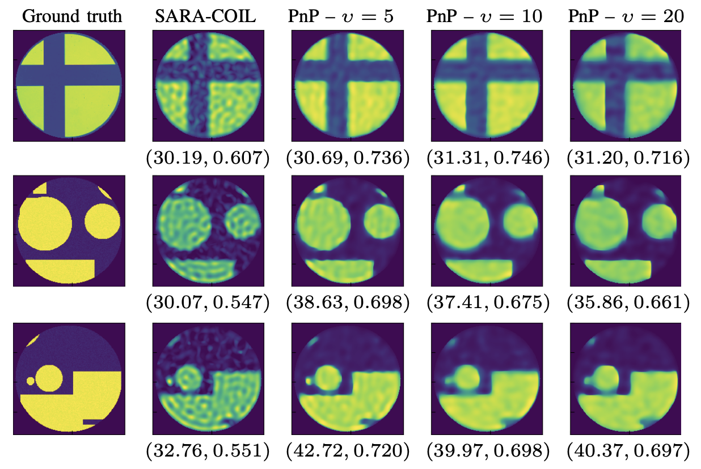

# Primal-dual plug-and-play algorithm with application to Computational Optical Imaging with a Photonic Lantern


<p align="center">
    
</p>


### Associated publications
<ul>
  <li><strong>PnP-COIL:</strong> <i>C. S. Garcia, M. Larchevêque, Solal O'Sullivan, M. Van Waerebeke, R. R. Thomson, A. Repetti, and J.-C. Pesquet</i>. <a href="https://arxiv.org/abs/2306.11679" target="_blank">A primal-dual data-driven method for computational optical imaging with a photonic lantern</a>, arXiv preprint 2306.11679, June 2023.</li>
  <li><strong>Learning MMOs (PnP):</strong> <i>J.-C. Pesquet, A. Repetti, M. Terris, and Y. Wiaux</i>. <a href="https://epubs.siam.org/doi/pdf/10.1137/20M1387961" target="_blank">Learning Maximally Monotone Operators for Image Recovery</a>. SIAM Journal on Imaging Sciences, vol. 14, no. 3, pp. 1206-1237, Aug. 2021</li>
  <li><strong>SARA-COIL:</strong> <i>D. Choudhury, D. K. McNicholl, A. Repetti, I. Gris-Sanchez, S. Li, D. B. Phillips, G. Whyte,  T. A. Birks,  Y. Wiaux, and R. R. Thomson</i>. <a href="https://www.nature.com/articles/s41467-020-18818-6" target="_blank">Computational optical imaging with a photonic lantern</a>.  Nature Communications, vol. 11, no. 1, pp. 5217,Oct. 2020</li>
</ul>


### Install
We use [git-lfs](https://git-lfs.com/) to store some of the large files needed to run our codes (including the linear measurement operator matrix, and the geometric images used in our article). Installing it is required to correctly download and run our code. See [this](https://github.com/git-lfs/git-lfs#getting-started) to check how to install it on your system. 

After installing git-lfs, pull this repository and install the required modules by running `pip install -r requirements.txt`


### Python code for SARA-COIL
To reproduce results using [SARA-COIL](https://arxiv.org/abs/1903.01288) algorithm (with python), run:
```
python3 main.py --mat_folder data --output_dir OUTPUT_DIR/ --method wavelets --nb_images 5 --(no-)verbose
```
This launches the SARA-COIL on the provided cross image (see image above) as well as 4 additional synthetic shapes we randomly generated (50 available in folder `shapes/`). Logs and the reconstructed images are available in the provided output directory. Add `--no-verbose` to remove intermediate logs about convergence.

### PnP-COIL
To reproduce results using the primal-dual Plug-and-Play (PnP) algorithm, choose a checkpoint and run:
```
python3 main.py --mat_folder data/ --output_dir OUTPUT_DIR/ --method dncnn --checkpoint CHECKPOINT_PATH/ --nb_images 5 --(no-)verbose
```
This launches the PnP algorithm using the provided checkpoint on the provided cross image (see image above) as well as 4 additional synthetic shapes (50 available in folder `shapes/`). Logs and the reconstructed images are available in the provided output directory. Add `--no-verbose` to remove intermediate logs about convergence.

Three checkpoints for DnCNNs trained on three noise levels are provided in `data/ckpt/` (trained on 60% of the test set of <a href="https://image-net.org" target="_blank">Imagenet dataset</a>).

### Training a denoiser
To train a network using our implementation, provide the path to a dataset in `train/config/config.yml` and run :
```
python3 main_train.py --config_path train/config/config.yml --run_name RUN_NAME
```
If the option `dataset_name` is left as `ImageNet` in the config file, the dataloader will assume the dataset folder contains all images (no nested subfolders) and will use our preprocessing strategy. The flag `--run_name` is useful when saving the checkpoints and using [wandb](https://wandb.ai) logger. This logger is used by default, so check [their](https://wandb.ai) website to correctly setup this or change this logger to another lightning-compatible logger.
